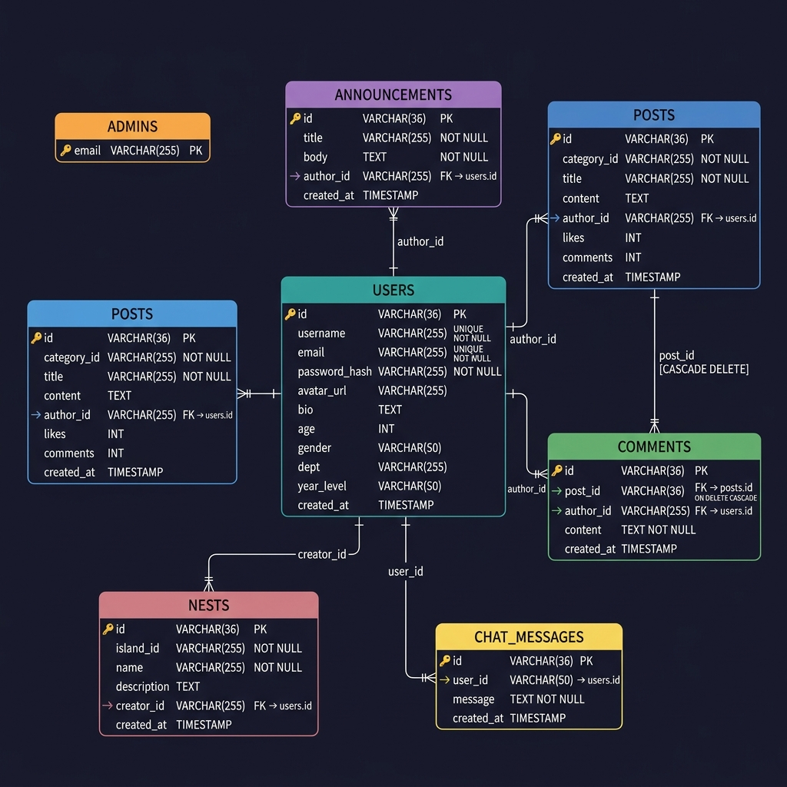

# Campusaurus 🦖

> A campus community platform for students to share discoveries, join island communities, comment, chat live, and play a daily Wordle.

---

## a. Introduction

### Background

Campus life generates a constant flow of information — announcements, academic discussions, group collaborations, and social interactions — that is typically fragmented across messaging apps, bulletin boards, and separate platforms. Campusaurus was developed to centralize this experience into a single, student-facing web application tailored to the structure and culture of a Philippine university campus.

### Problem Statement

Students lack a unified digital space to:
- Receive official announcements in real time
- Organize discussions by college or interest group
- Engage with peers through posts and comments
- Access campus-specific features (like a shared daily game) in a familiar environment

Existing general-purpose platforms (Facebook groups, group chats) offer no structure, moderation control, or campus-specific organization.

### Scope

**Included:**
- User registration and session-based authentication
- Campus announcements (admin-managed)
- Posts organized by Islands (colleges) and Nests (sub-communities)
- Inline commenting on posts
- Live chat (polling-based, refreshes every 5 seconds)
- User profiles with avatar, department, and year level
- Daily Wordle mini-game
- Admin privilege system

**Not included:**
- Real-time WebSocket communication
- Mobile application
- File/image upload in posts
- Private messaging between users
- Email verification or password reset

### Target Users

| User Type | Description |
|-----------|-------------|
| **Students** | Primary users — browse posts, join nests, comment, chat, and play Wordle |
| **Administrators** | Faculty or staff — post announcements, moderate content |
| **Guests** | Unauthenticated visitors — read-only access to the feed |

---

## b. Project Objectives

### Primary Objective

To develop a full-stack web application that serves as a centralized campus community platform, enabling students and administrators to interact, share information, and engage with campus-specific content.

### Secondary Objectives

1. **Database Connectivity** — Establish a stable and persistent connection to a MySQL database via SQLAlchemy ORM, with automatic table creation and session management.
2. **User Interface** — Deliver a visually consistent, responsive UI using a shared CSS design system with dark-mode theming, CSS variables, and micro-animations.
3. **Data Management** — Implement full CRUD operations for posts, comments, announcements, nests, and chat messages with proper validation and authorization.
4. **Search Functionality** — Enable real-time client-side search and island-based filtering on the post feed without additional server requests.

---

## c. Business Rules

### Detailed Business Logic

#### User Authentication
- Passwords are hashed using Werkzeug's `generate_password_hash` (PBKDF2-SHA256); plaintext passwords are never stored.
- Sessions are managed server-side via Flask's signed cookie session (`SECRET_KEY`).
- A user is considered "logged in" if `session['user_id']` is present and resolves to a valid user record.
- Usernames and email addresses must be unique across all accounts.

#### Database Connection
- The application connects to MySQL using PyMySQL via SQLAlchemy's `create_engine`.
- Connection settings are loaded from environment variables (`.env`) — never hardcoded.
- `db.create_all()` runs on application startup to ensure all tables exist.

#### CRUD Operation Constraints
- **Create:** `title` and `categoryId` are required for posts; `title` and `body` for announcements; `content` for comments.
- **Update (PATCH):** Only the authenticated author or an admin may update a post or announcement.
- **Delete:** Only the authenticated author or an admin may delete a post. Any logged-in user may add a comment; only admins may remove others' comments.
- Empty strings after stripping whitespace are rejected with a `400` error.

#### Data Validation Rules
- All string inputs are stripped of leading/trailing whitespace before processing.
- Empty required fields return `400 Bad Request` with a descriptive error message.
- Invalid or non-existent resource IDs return `404 Not Found`.
- Unauthorized operations return `401` (not logged in) or `403` (forbidden).

#### Access Control Levels

| Level | Who | Permissions |
|-------|-----|-------------|
| Guest | Unauthenticated | Read posts, announcements |
| Student | Authenticated user | All of above + create posts, comment, chat, create nests |
| Admin | Email in `admins` table | All of above + edit/delete any post or announcement |

### Constraints

- Requires XAMPP (Apache + MySQL) running locally on port `3306`.
- Python 3.9 or higher is required.
- The application serves on `localhost:8080` only; no HTTPS in the current scope.
- The `admins` table uses email as the primary key — admin rights are granted by inserting a row directly into the database.
- `__pycache__` and `.env` are excluded from version control via `.gitignore`.

### Conditions

- A valid session cookie must exist for all write operations (POST, PATCH, DELETE).
- The database server must be running before the Flask application starts.
- If the `users` table is inaccessible at startup, the application logs a warning and falls back gracefully rather than crashing.
- Chat messages are refreshed via client-side polling every 5 seconds — no persistent connection is maintained.

---

## d. Database Models

### Entity Relationship Diagram (ERD)



**Entities and Relationships:**
- A **User** can create many **Posts**, **Announcements**, **Comments**, **Nests**, and **ChatMessages**.
- A **Post** belongs to one **Nest** (via `category_id`) and can have many **Comments**.
- A **Nest** belongs to one Island (stored as a string identifier) and is created by one **User**.
- An **Admin** record (email only) grants elevated privileges to a **User** with a matching email.

### Relational Model

| Table | Attributes |
|-------|-----------|
| `users` | `id` (PK), `username`, `email`, `password_hash`, `avatar_url`, `bio`, `age`, `gender`, `dept`, `year_level`, `created_at` |
| `admins` | `email` (PK) |
| `announcements` | `id` (PK), `title`, `body`, `author_id` (FK → users), `created_at` |
| `posts` | `id` (PK), `category_id`, `title`, `content`, `author_id` (FK → users), `likes`, `comments`, `created_at` |
| `comments` | `id` (PK), `post_id` (FK → posts), `author_id` (FK → users), `content`, `created_at` |
| `nests` | `id` (PK), `island_id`, `name`, `description`, `creator_id` (FK → users), `created_at` |
| `chat_messages` | `id` (PK), `user_id` (FK → users), `message`, `created_at` |

---

## e. Project Overview

### Architecture

Campusaurus follows a **client-server architecture** with a clear separation of concerns:

```
Browser (HTML/CSS/JS)
        │
        │  HTTP (REST API)
        ▼
Flask Application (src/app.py)
        │
        │  SQLAlchemy ORM
        ▼
MySQL Database (XAMPP)
```

The backend loosely follows **MVC**:
- **Model** — `src/models.py` (SQLAlchemy ORM classes)
- **View** — `public/` (static HTML/CSS/JS pages served by Flask)
- **Controller** — `src/app.py` (Flask route handlers)

### Key Components

| Component | Location | Responsibility |
|-----------|----------|----------------|
| Flask App | `src/app.py` | Route definitions, auth, request handling |
| ORM Models | `src/models.py` | Database table definitions and relationships |
| Store Modules | `src/*_store.py` | Encapsulated DB queries per feature |
| Design System | `public/base.css` | Global CSS variables, nav, breadcrumbs, toasts |
| API Client | `public/api.js` | Centralized fetch wrapper for all frontend pages |
| Toast Module | `public/toast.js` | Shared notification utility (replaces `alert()`) |
| Page Scripts | `public/*/script.js` | Per-page logic as ES modules |

---

## f. Setup Instructions

### Prerequisites

- Python 3.9+
- XAMPP (Apache + MySQL) — https://www.apachefriends.org/
- Git
- A modern web browser (Chrome, Firefox, Edge)

### Step-by-Step Installation

#### 1. Clone the Repository
```bash
git clone https://github.com/jksalcedo/campusaurus.git
cd campusaurus
```

#### 2. Set Up a Virtual Environment
```bash
python -m venv .venv
source .venv/bin/activate        # Linux/macOS
.venv\Scripts\activate           # Windows
```

#### 3. Install Dependencies
```bash
pip install -r requirements.txt
```

#### 4. Configure and Import the Database

- Open XAMPP Control Panel and start **Apache** and **MySQL**
- Open phpMyAdmin at http://localhost/phpmyadmin
- Create a new database named `campusaurus`
- Import `schema.sql` — this creates all tables and inserts sample data

#### 5. Set Environment Variables

Copy `.env.example` to `.env` and fill in your values:

```bash
cp .env.example .env
```

```env
DB_HOST=localhost
DB_PORT=3306
DB_USER=root
DB_PASSWORD=
DB_NAME=campusaurus
SECRET_KEY=your-secret-key-here
```

#### 6. Run the Application

```bash
python server.py
```

#### 7. Access in Browser

Open http://localhost:8080

---

## g. Team Members & Roles

| Name | Role | Responsibilities |
|------|------|-----------------|
| Jaressen Kyle Salcedo | Backend Developer | Flask routes, database models, API design |
| Kurt Rainier Aquino | Frontend Developer | HTML/CSS pages, JavaScript, UI/UX |
| Chris Jerico Francisco | Frontend Developer | HTML/CSS pages, JavaScript, UI/UX |

---

## h. Dependencies

### Python Packages

| Package | Version | Purpose |
|---------|---------|---------|
| Flask | 3.0.3 | Web framework and routing |
| Flask-SQLAlchemy | 3.1.1 | ORM for database models |
| flask-cors | 4.0.0 | Cross-Origin Resource Sharing |
| PyMySQL | 1.1.0 | MySQL database driver |
| python-dotenv | 1.0.0 | Load environment variables from `.env` |
| blinker | 1.9.0 | Flask signal support (Flask dependency) |
| Werkzeug | *(via Flask)* | Password hashing, request utilities |

### System Requirements

| Requirement | Minimum Version |
|-------------|----------------|
| Operating System | Windows 10 / macOS 12 / Ubuntu 20.04 |
| Python | 3.9+ |
| MySQL | 5.7+ (via XAMPP) |
| XAMPP | 8.x |
| Browser | Chrome 110+ / Firefox 110+ / Edge 110+ |
| Git | 2.x |

---

## i. Running Instructions

### Start the Application

1. Open **XAMPP Control Panel** → Start **Apache** and **MySQL**
2. Activate the virtual environment:
   ```bash
   source .venv/bin/activate   # Linux/macOS
   .venv\Scripts\activate      # Windows
   ```
3. Run the server:
   ```bash
   python server.py
   ```
4. Open http://localhost:8080 in your browser

### Stop the Application

- Press `Ctrl + C` in the terminal to stop Flask
- Stop Apache and MySQL in XAMPP Control Panel

### Default Login Credentials

| Role | Email | Password |
|------|-------|----------|
| Student | `student1@example.com` | *(see schema.sql — hashed, use Register)* |
| Admin | `kurtaquino49@gmail.com` | *(set during registration)* |

> For a live demo, register a new account via `/register/` — it takes under 30 seconds.

### Navigating the Application

| Page | URL | Description |
|------|-----|-------------|
| Base Camp (Feed) | `/` | Main post feed with search and island filter |
| Announcements | `/announcements/` | Campus-wide announcements board |
| Islands | `/islands/` | College island overview with stats |
| Nests | `/nest/?island=ccs` | Sub-community nests for a specific island |
| Create Post | `/create/` | Log a new discovery (post or announcement) |
| Profile | `/profile/` | View and edit your user profile |
| Login | `/login/` | Sign in to your account |
| Register | `/register/` | Create a new student account |
| Wordle | `/wordle/` | Daily Wordle mini-game |
